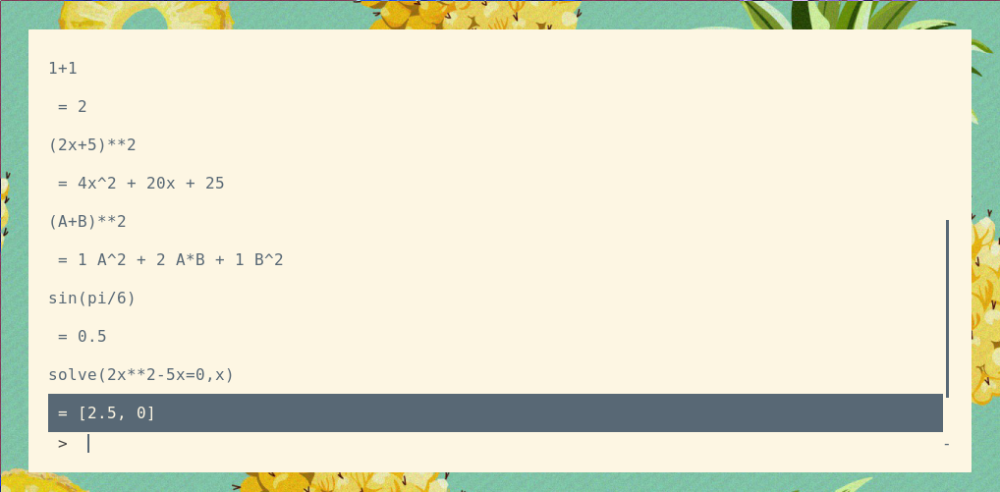
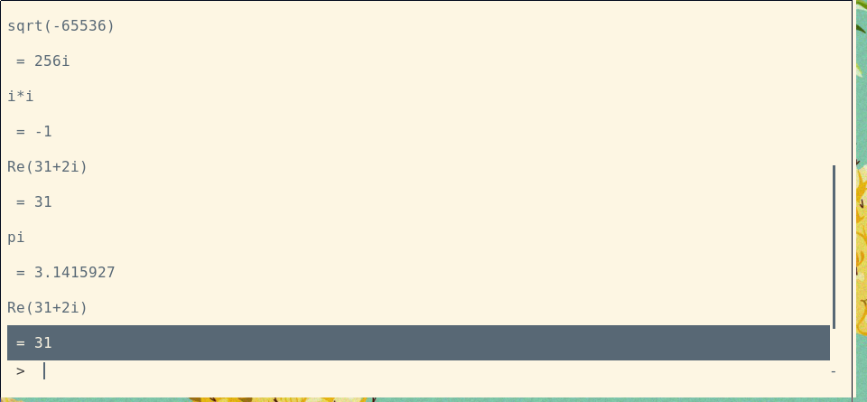

# rofi-qalc
Qalc frontend with rofi. Inspired by [menu-calc](https://github.com/sumnerevans/menu-calc).
Rofi-qalc comes with an history, and rofi. I wasted to make this because menu-calc was lacking history and to make a use of the powerful qalc.



# Usage
To use rofi-qalc, just run it and you can start typing mathematical expression. I suggest you to look at the qalc documentation for more.
You can also use the ```clear``` command to delete your history.
# Installation
* Dependencies
  - bash
  - rofi
  - qalc

To install rofi-qalc, move ```rofi-qualc.sh``` into a directory, eg: ```~/.config/rofi/```. Then you can create a keybind to start it (in i3: ```bindsym $mod+c exec bash ~/.config/rofi/rofi-qalc.sh```).
By default the history file is ```~/.config/rofi/rofi-qalc-history``` however you can change it thewherever you like.
